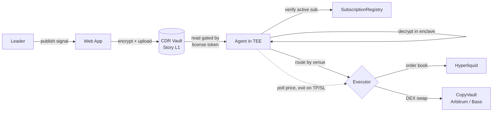

# Sigmax — Confidential Copy-Trading

> **Leaders publish encrypted trading signals. Followers copy them automatically.**
> The strategy never leaks — but the leader's track record stays verifiable on-chain.

A trader (the *leader*) encrypts every trading signal. Followers subscribe with a monthly payment. Code running inside a **TEE** is the only thing that can decrypt a signal — and only to place the trade on each follower's behalf, inside that follower's own non-custodial vault. Followers copy the *result*, never the strategy, and nothing in the system can touch their funds.

## Two builds, one product

Sigmax exists in two implementations of the same idea. **The Flare build is the current one.**

| | **Flare build (current)** | Story build (original) |
|---|---|---|
| Branch | `feat/flare-migration` | `main` |
| Confidentiality | ECIES encrypt-to-enclave, **client-side** | Story CDR threshold encryption (server-side) |
| Confidential compute | **Flare Confidential Compute (FCC)** extension | off-chain TEE agent |
| Execution | FXRP swaps on Coston2, FTSO-bounded `minOut` | Arbitrum / Hyperliquid |
| Trust gate | **On-chain `ecrecover` of the TEE's `ActionResult`** before any swap | executor role on the vault |
| Chains | Coston2 only (114) | Story Aeneid + Arbitrum |
| Built for | Flare Summer Signal hackathon | CDR Hackathon (build.usecdr.dev, presented by Story) |

**Reading the Flare build:** start at [`docs/flare/submission.md`](docs/flare/submission.md) for what it
is and what's proven, [`docs/superpowers/specs/2026-07-23-sigmax-on-flare-design.md`](docs/superpowers/specs/2026-07-23-sigmax-on-flare-design.md)
for the design, and [`docs/flare/reference/fcc-extension.md`](docs/flare/reference/fcc-extension.md)
for the TEE extension in [`fce-sigmax/`](fce-sigmax/).

Two things worth knowing about the Flare build, because they are the seams where this kind of system
usually breaks quietly, and both are covered by tests rather than assumed:

- The signal is encrypted **in the leader's browser**, so no server — including ours — ever sees a
  strategy. That the browser's ECIES really is decryptable by the enclave is proven against the
  TEE node's own go-ethereum, not assumed ([`packages/cdr/test/geth-interop.test.ts`](packages/cdr/test/geth-interop.test.ts)).
- A swap moves funds only if `ecrecover` over the TEE's signed result matches the registered TEE
  address, so the executing party is trustless — a tampered authorization simply reverts.

The rest of this README describes the **original Story build**, which remains accurate for that
branch and is kept for history.

---

## Table of contents

1. [The problem](#the-problem)
2. [The solution](#the-solution)
3. [How Sigmax uses CDR](#how-sigmax-uses-cdr)
4. [How it works](#how-it-works)
5. [The 2 wallets you need (read this first)](#the-2-wallets-you-need-read-this-first)
6. [What's built](#whats-built)
7. [Run it yourself — step by step](#run-it-yourself--step-by-step)
   - [Track A — Hyperliquid (recommended, fully live)](#track-a--hyperliquid-recommended-fully-live)
   - [Track B — Arbitrum / EVM (for developers)](#track-b--arbitrum--evm-for-developers)
   - [The web app](#the-web-app)
8. [Troubleshooting & FAQ](#troubleshooting--faq)
9. [Tech stack](#tech-stack)
10. [Repo structure](#repo-structure)
11. [Security model](#security-model)
12. [Roadmap](#roadmap)

---

## The problem

Every trader who sells signals hits the same wall:

- **Share the strategy and it leaks.** The moment you post calls in a private/paid group, one member can screenshot everything, repost it, forward it to friends, or resell your entire feed. Whole Telegram channels (30–50k members) exist purely to leak paid signals. Your edge gets copied and devalued the second you share it.
- **Keep the strategy secret and nobody trusts you.** Without a verifiable record, followers can't tell a real trader from a scammer — so they won't pay.

Today you can't have both: you either protect the alpha and lose trust, or prove the record and lose the alpha.

## The solution

Sigmax removes the trade-off:

- **The signal is encrypted end-to-end.** Each signal is threshold-encrypted into a CDR vault on Story L1. No one — not other followers, not the public, not even our own backend — can read it.
- **Only a TEE agent ever decrypts it.** The agent decrypts inside a trusted execution environment, purely to place the trade. The strategy, entry logic and exit targets never appear on-chain and never leave the enclave.
- **Followers copy the result, not the recipe.** Each follower's trade is executed automatically against their own funds. They never receive the underlying strategy — so there's nothing to screenshot, leak, or resell.
- **The record stays provable.** Every signal is committed to a CDR vault and every resulting trade is an on-chain event, so a leader's performance is independently verifiable without exposing *how* they trade.

The result: **a secret strategy and a provable track record at the same time.**

---

## How Sigmax uses CDR

**CDR isn't a feature bolted onto Sigmax — it's the foundation the whole product stands on.** The core promise (a strategy that stays secret *and* a track record anyone can verify) is impossible on a normal chain and untrustworthy in a normal database. CDR is the one primitive that makes it real, and Sigmax uses it end-to-end.

**What we put in CDR.** Every trading signal — the token, direction, size, entry limit, and the *secret* take-profit / stop-loss — is encoded to bytes and **threshold-encrypted into a CDR vault on Story L1**. The plaintext signal never exists on-chain, in our backend, or in the frontend. It is only ever reconstructed in agent memory at execution time.

**The write path (leader publishes).**
The leader's signal is uploaded via the CDR SDK's `uploadCDR`, which allocates a vault, encrypts the data key, and writes the ciphertext. Writing is gated by an on-chain **owner-write condition** — only the strategy's owner can publish into its vault. The leader gets back the vault id + the Story L1 proof hashes (this is the verifiable commitment to "a signal existed at time T").

**The read path (agent decrypts).**
The agent calls `accessCDR`. Before any decryption shares are released, CDR evaluates an on-chain **license-read condition** that checks the caller holds the strategy's **Story License Token**. Only then is the signal **threshold-decrypted inside the TEE**. A wrong or missing license is rejected at the protocol level — there's no code path that hands out plaintext to an unauthorized reader.

**The key idea — CDR access control *is* the business model.**
Because CDR binds decryption rights to an on-chain **Story License Token**, the question "who is allowed to read this signal?" becomes literally "who holds a valid license?" — i.e. the authorized agent acting on behalf of paying subscribers. The encryption layer and the subscription / IP / royalty layer are **the same system**: pay → get a license → the agent's read condition passes → your trade executes. There is no separate key server, no trusted middleman ever holding plaintext, and nothing to leak.

**Why threshold encryption matters here.**
Decryption requires a quorum of partials from the CDR network — **no single party (not even us) can unilaterally decrypt a signal.** Paired with the TEE, the secret strategy has nowhere to leak: not on-chain, not from our servers, not to other followers.

These two conditions are live, deployed contracts on Story Aeneid:

| Role | Contract | Address |
|---|---|---|
| Only the leader can **write** a signal | Owner-Write Condition | `0x4C9bFC96d7092b590D497A191826C3dA2277c34B` |
| Only a license holder can **read/decrypt** | License-Read Condition | `0xC0640AD4CF2CaA9914C8e5C44234359a9102f7a3` |
| The license that unlocks reads | License Token (ERC-721) | `0xFe3838BFb30B34170F00030B52eA4893d8aAC6bC` |

> **Strip CDR out and Sigmax can't exist.** You'd be back to the original trap: either publish the strategy and watch the alpha leak, or hide it in a black box and ask followers to trust you blindly. CDR is exactly what lets us keep the signal confidential *while* its access is provably enforced on-chain.

---

## How it works



1. **Publish.** The leader publishes a signal. It is encoded, threshold-encrypted, and uploaded to a CDR vault on Story L1. The leader gets back the vault id and on-chain proof hashes.
2. **Gate.** Read access is gated on-chain: only the holder of the strategy's operator **license token** (the agent) can decrypt the vault.
3. **Decrypt.** The agent fetches the ciphertext and decrypts it *inside the TEE*. The plaintext lives only in enclave memory — never logged, never persisted, never sent to the frontend.
4. **Fan-out.** For each follower the agent verifies an **active subscription**, reads their live balance, sizes the position (a bounded % of balance), and submits the trade. Followers are isolated — one failure never blocks the others.
5. **Route.** The signal is sent to its venue: **Hyperliquid** (on-chain order book) or an **EVM chain** (DEX swap through the follower's own vault).
6. **Monitor & exit.** A take-profit / stop-loss monitor polls live prices and auto-exits when a target is crossed.

---

## The 2 wallets you need (read this first)

This is the single most important thing to understand before running anything. Sigmax involves **two user wallets and one auto-generated bot key**:

| | What it is | Lives on | Needs funding with | In this repo |
|---|---|---|---|---|
| 🟦 **Wallet A — Leader** | The trader. Registers the strategy, encrypts & publishes signals, owns the revenue. In this demo it *also* acts as the agent's identity that holds the license and decrypts. | **Story Aeneid** | test **IP** (gas) + a little **$WIP** (license fee) | `CDR_KEY` / `STORY_IP_KEY` / `LEADER_PK` |
| 🟩 **Wallet B — Follower** | The copier. Its money is what trades. Deposits funds, approves the agent to trade for it. | **Hyperliquid testnet** | test **USDC** | `MASTER_PK` / `FOLLOWER_PK` / `FOLLOWERS` |
| 🤖 **Agent key** | The bot's signing key. Places orders. **Can trade, can never withdraw.** Auto-generated — you don't fund it. | Hyperliquid | nothing | `HYPERLIQUID_AGENT_PK` (from `hl-gen-agent`) |

> **In short: create two fresh wallets (two private keys).** Wallet A on Story, Wallet B on Hyperliquid. The agent key is generated for you in step 2 below. Funds always stay in Wallet B — the agent can only place trades on it, never move money out.

---

## What's built

### 🔐 Confidential signals — CDR + Story (live)
- Real threshold encryption via **`@piplabs/cdr-sdk`** on Story **Aeneid** — no mock path, fully live.
- Publishing allocates a CDR vault and writes the ciphertext, gated by an **owner-write condition** (only the leader can write). Decryption is gated by a **license-read condition** (only the agent's operator license can read; invalid/missing license → denied).
- **Story IP layer:** each strategy is registered as a **Story IP Asset** with **PIL** commercial terms; subscriptions mint a license and route revenue through Story's royalty system.
- Confidentiality is enforced by a dedicated redaction test — the secret never gets logged.

### 🤖 The agent (live)
- TypeScript, **TEE-ready**. One agent serves many leaders: it discovers every operator license it holds by scanning license-token transfer events, then services all of them.
- **Per-follower pipeline:** subscription check → live balance → position sizing → execution → tracking. State is in-memory with on-disk durability; TP/SL targets are deliberately kept *out* of persisted state.
- **TP/SL monitor:** polls live prices on an interval and fires an exit the instant a threshold is crossed.
- HTTP surface: `GET /health`, `POST /signals/publish`. The signal body is never logged.

### 📈 Hyperliquid execution (live)
- Trades on the **Hyperliquid** order book via the `@nktkas/hyperliquid` SDK — **IOC orders**, market or limit, respecting the signal's max-entry price.
- **Non-custodial:** authorized through Hyperliquid's native **`approveAgent`** — the agent places orders but **cannot withdraw or transfer funds, ever**.
- Helper scripts: `hl-gen-agent`, `hl-approve`, `hl-publish`.

### ⛓️ EVM execution — CopyVault on Arbitrum / Base (built)
- **`CopyVault.sol`** — a non-custodial per-follower vault. Only the owner can `withdraw`. The agent has a scoped role that can call `executeSwap` only, constrained by a **token whitelist, router whitelist, per-trade cap, and an on-chain min-out** computed from real balance deltas. If the agent key is ever compromised, funds can at worst be swapped within the whitelist — never withdrawn.
- **`CopyVaultFactory.sol`** — one deterministic vault per follower via CREATE2.
- DEX execution via **0x** with slippage protection. Venue is selectable via `EXECUTION_VENUE`; the pipeline and TP/SL monitor are venue-agnostic.

### 💸 Subscriptions & revenue (built)
- **`SubscriptionRegistry.sol`** — leaders `createPlan` (keyed by their Story IP id, with a monthly price + platform fee). Followers `subscribe`; payment is pulled and split between leader and platform treasury; `isActive` gates execution with a short grace period. Early renewals stack without losing time.

### 🖥️ Web app (built)
- **Vite + React + wagmi/viem**, TanStack Router. Leader (register strategy, publish signals, see the CDR vault hash + proof), follower (browse leaderboard, subscribe, fund, authorize), and verifiable per-leader leaderboard pages.

### ✅ Tests
- **Agent:** pipeline fan-out & idempotency, sizing, TP/SL crosses, Hyperliquid order/meta math, state persistence, confidentiality/redaction.
- **Contracts (Foundry):** `CopyVault` swap + cap + min-out (against an Arbitrum fork), factory determinism, registry fee-split / eligibility.
- **Shared/CDR:** signal schema + encode/decode round-trip, CDR publish/access round-trip.

### Execution venues

| Venue | Status | Approx. liquidity |
|---|---|---|
| **Hyperliquid** (on-chain order book) | ✅ Live | ~$5B+ daily volume |
| **Arbitrum + Base** (DEX via 0x) | ✅ Built | ~$5B+ on-chain DEX liquidity |
| **DeepBook on Sui** (CLOB) | 🔜 Planned | ~tens of millions, growing fast |

---

## Run it yourself — step by step

### Prerequisites

- **Node.js ≥ 22** and **pnpm** (`npm i -g pnpm`)
- **git**
- **Foundry** (only for the contract tests / EVM track) — <https://getfoundry.sh>
- **Two wallets** — see [The 2 wallets you need](#the-2-wallets-you-need-read-this-first). Easiest: generate two fresh private keys.

```bash
git clone <this-repo> sigmax
cd sigmax
pnpm install
```

---

### Track A — Hyperliquid (recommended, fully live)

This runs the complete loop: encrypt a signal on Story → decrypt in the agent → place a real order on Hyperliquid testnet for your follower wallet.

#### Step 0 — Fund your two wallets

- **Wallet A (Story Aeneid):** get test **IP** from the faucet → <https://aeneid.faucet.story.foundation>. Then wrap a small amount of IP into **$WIP** (used as the license/subscription fee).
- **Wallet B (Hyperliquid testnet):** open <https://app.hyperliquid-testnet.xyz>, connect Wallet B, and get test **USDC** from the faucet. Confirm it shows up as your **USDC** balance. *(Note: the HL testnet faucet sometimes requires a tiny real mainnet balance to unlock — see [FAQ](#troubleshooting--faq).)*

#### Step 1 — Register the strategy on Story & mint the agent's license

This registers your strategy as a Story IP Asset, attaches subscription terms, and mints the **operator license** to the agent (here: Wallet A itself, so one wallet plays leader + agent).

```bash
STORY_IP_KEY=0x<WALLET_A_PRIVATE_KEY> \
AGENT_ADDRESS=0x<WALLET_A_ADDRESS> \
  pnpm --filter @sigmax/story exec tsx scripts/poc-story.ts
```

📋 **Copy from the output:** `STRATEGY_IP_ID` and `OPERATOR_LICENSE_TOKEN_ID`.

#### Step 2 — Generate the agent's Hyperliquid key

```bash
pnpm --filter @sigmax/agent exec tsx scripts/hl-gen-agent.ts
```

📋 **Copy from the output:** `HL_AGENT_ADDRESS` and `HYPERLIQUID_AGENT_PK`.

#### Step 3 — Follower approves the agent (`approveAgent`)

Wallet B authorizes the agent key to trade on its behalf (trade-only — it can never withdraw).

```bash
MASTER_PK=0x<WALLET_B_PRIVATE_KEY> \
HL_AGENT_ADDRESS=0x<FROM_STEP_2> \
HYPERLIQUID_TESTNET=true \
  pnpm --filter @sigmax/agent exec tsx scripts/hl-approve.ts
```

#### Step 4 — Configure the agent

Create `packages/agent/.env` (start from the template: `cp packages/agent/.env.hl.example packages/agent/.env`) and fill it in:

```bash
# --- Venue ---
EXECUTION_VENUE=hyperliquid
HYPERLIQUID_TESTNET=true

# --- Keys ---
AGENT_PK=0x<HYPERLIQUID_AGENT_PK_FROM_STEP_2>        # executor key (any valid key; reuse the HL agent key)
HYPERLIQUID_AGENT_PK=0x<HYPERLIQUID_AGENT_PK_FROM_STEP_2>

# --- Confidential signals (CDR on Story) ---
CDR_KEY=0x<WALLET_A_PRIVATE_KEY>                      # holds the operator license; encrypts + decrypts
STORY_API_URL=http://172.192.41.96:1317              # Story-API for CDR (may change between deployments)
STORY_RPC_URL=https://aeneid.storyrpc.io
STRATEGY_IP_ID=0x<FROM_STEP_1>
OPERATOR_LICENSE_TOKEN_ID=<FROM_STEP_1>

# --- Follower + demo bypass ---
FOLLOWERS=0x<WALLET_B_ADDRESS>
TRUST_CONFIGURED_FOLLOWERS=true                       # demo: treat FOLLOWERS as subscribed (skip on-chain sub)

# --- Trade limits / monitor ---
HYPERLIQUID_PER_TRADE_CAP=1500000000                  # $15 in 1e8 units
POLL_MS=10000
DEFAULT_SLIPPAGE_BPS=100                              # 1%
HTTP_PORT=8787
```

> Setting `TRUST_CONFIGURED_FOLLOWERS=true` skips the *payment* step so you can demo fast. To require a real on-chain subscription instead, see [Step 7](#step-7--optional-require-a-real-on-chain-subscription).

#### Step 5 — Start the agent

```bash
pnpm --filter @sigmax/agent start
```

It auto-loads `packages/agent/.env`. Watch the logs for the discovered license, the active follower, and the TP/SL monitor starting. Health check: `curl http://localhost:8787/health`.

#### Step 6 — Publish a signal (you are the leader)

In a second terminal — this POSTs the signal to the running agent, which encrypts it on Story, decrypts it in-process, sizes Wallet B's position, and places the order on Hyperliquid:

```bash
AGENT_API_URL=http://localhost:8787 \
STRATEGY_IP_ID=0x<FROM_STEP_1> \
HL_TOKEN=HYPE HL_QUOTE=USDC \
HL_ACTION=ENTRY HL_SIZE_BPS=500 \
HL_MAX_ENTRY=0 \
  pnpm --filter @sigmax/agent exec tsx scripts/hl-publish.ts
```

- `HL_SIZE_BPS=500` → spend 5% of the follower's balance (capped at 20% by design).
- `HL_MAX_ENTRY=0` → **market** order. A non-zero value (e.g. `HL_MAX_ENTRY=25`) → **limit** entry that fills only if marketable, otherwise skips.
- Add `HL_TP=30 HL_SL=18` to attach take-profit / stop-loss — the monitor will auto-exit when crossed.

✅ **Verify:** open <https://app.hyperliquid-testnet.xyz>, connect Wallet B, and you'll see the position the agent just opened.

#### Step 7 — (optional) Require a real on-chain subscription

To prove the full paid flow instead of the bypass:

```bash
# Leader creates a plan once (needs a deployed SubscriptionRegistry — see Track B / DeploySubscriptionRegistry)
LEADER_PK=0x<WALLET_A> STRATEGY_IP_ID=0x<ip> REGISTRY_ADDRESS=0x<registry> \
  pnpm --filter @sigmax/agent exec tsx scripts/sub-create-plan.ts

# Follower subscribes (approves $WIP + calls subscribe)
FOLLOWER_PK=0x<WALLET_B> STRATEGY_IP_ID=0x<ip> REGISTRY_ADDRESS=0x<registry> \
  pnpm --filter @sigmax/agent exec tsx scripts/sub-subscribe.ts
```

Then in `.env` set `TRUST_CONFIGURED_FOLLOWERS=false` and `REGISTRY_ADDRESS=0x<registry>`, and restart the agent.

---

### Track B — Arbitrum / EVM (for developers)

The EVM path (`CopyVault` + `CopyVaultFactory` + 0x swaps) is **fully implemented and tested**, but it's exercised against an **Arbitrum mainnet fork** (there's no one-command live deploy yet). To run it:

**Run the contract test suite against a fork:**

```bash
cd packages/contracts
forge install        # first time only
forge test -vvv      # CopyVault swaps, cap + min-out enforcement, factory CREATE2, registry fee split
```

**Or drive the agent against a local fork** (advanced): start an Anvil fork of Arbitrum, deploy a `CopyVaultFactory`, then run the agent with:

```bash
# in packages/agent/.env
EXECUTION_VENUE=arbitrum
ARBITRUM_RPC_URL=http://127.0.0.1:8545     # anvil --fork-url https://arb1.arbitrum.io/rpc
AGENT_PK=0x<agent executor key>
ZEROX_API_KEY=<optional; falls back to a direct Uniswap v3 call>
```

> The same signal schema and pipeline drive both venues — only the executor changes. Arbitrum needs real liquidity, which is why it's demoed on a fork (Aeneid has no real liquidity).

**Deploy the SubscriptionRegistry (Story L1):**

```bash
cd packages/contracts
forge script script/DeploySubscriptionRegistry.s.sol \
  --rpc-url https://aeneid.storyrpc.io --broadcast --legacy
# set PLATFORM_TREASURY in your env first; --legacy is required on Story RPC
```

---

### The web app

```bash
# apps/web/.env — point it at your deployments
VITE_REGISTRY_ADDRESS=0x<SubscriptionRegistry>
VITE_AGENT_ADDRESS=0x<WALLET_A_ADDRESS>      # the address that holds the operator license
VITE_STRATEGY_IP_ID=0x<STRATEGY_IP_ID>
VITE_AGENT_API_URL=http://localhost:8787     # the running agent

pnpm --filter @sigmax/web dev                # http://localhost:5173
```

Connect a wallet: the leader can register a strategy & publish signals; the follower can subscribe & authorize the agent. **If the addresses aren't set, the UI falls back to mock data so every page still renders** — handy for a quick visual tour without any backend.

---

## Troubleshooting & FAQ

**How many wallets do I really need?**
Two: Wallet A (leader, on Story Aeneid) and Wallet B (follower, on Hyperliquid). The agent's signing key is generated for you in Track A · Step 2.

**Where do I get test funds?**
- Story IP (gas): <https://aeneid.faucet.story.foundation> — then wrap a little to **$WIP**.
- Hyperliquid testnet USDC: faucet inside <https://app.hyperliquid-testnet.xyz>.

**The HL faucet won't give me USDC.** Hyperliquid's testnet faucet can require a tiny real mainnet balance/deposit to unlock. Either deposit the minimum once, or run the EVM track on a fork instead.

**The agent starts but won't decrypt signals.** The wallet in `CDR_KEY` must be the same address you minted the operator license to (`AGENT_ADDRESS` in Step 1). Also confirm `STORY_API_URL` is reachable and `STRATEGY_IP_ID` / `OPERATOR_LICENSE_TOKEN_ID` match Step 1's output.

**CDR network error / wrong chain.** For Story **Aeneid**, the CDR network is `"testnet"` (not `"aeneid"`). This is already wired in the code — just don't override it.

**Story transactions fail with a fee/gas error.** Story RPC needs **legacy** transactions. The scripts already set this; for `forge script` add `--legacy`.

**Nothing trades after I publish.** Check that Wallet B approved the agent (Step 3), that Wallet B actually holds USDC, and that the agent log shows the follower as active. With `TRUST_CONFIGURED_FOLLOWERS=false`, Wallet B must have a live subscription (Step 7).

---

## Tech stack

| Layer | Stack |
|---|---|
| Confidential data | Story **CDR** (`@piplabs/cdr-sdk`), threshold encryption on Story L1 |
| IP & revenue | Story Protocol (IP Assets, PIL terms, License Tokens, Royalty) |
| Agent | TypeScript, TEE-ready, `@nktkas/hyperliquid`, viem |
| Execution | Hyperliquid order book; 0x DEX swaps on Arbitrum / Base |
| Contracts | Solidity + Foundry (`CopyVault`, `CopyVaultFactory`, `SubscriptionRegistry`) |
| Web | Vite + React, wagmi/viem, TanStack Router |
| Monorepo | pnpm workspaces + Turbo |

---

## Repo structure

```
apps/
  web/                  # @sigmax/web — Vite + React frontend
packages/
  agent/                # @sigmax/agent — TEE agent: decrypt → fan-out → execute → monitor
    src/hyperliquid/    #   Hyperliquid executor, price source, order math
    scripts/            #   hl-gen-agent, hl-approve, hl-publish, sub-create-plan, sub-subscribe
  cdr/                  # @sigmax/cdr — CDR threshold encryption (publish/access)
  story/                # @sigmax/story — Story IP: register strategy, attach terms, mint license
  contracts/            # CopyVault, CopyVaultFactory, SubscriptionRegistry (+ Foundry tests)
  shared/               # @sigmax/shared — signal schema, chain configs, deployed addresses
docs/                   # Design docs (architecture, agent, contracts, business)
```

---

## Running Locally

```bash
# Install dependencies
pnpm install

# Contracts (Foundry)
forge build
forge test -vvv

# Agent
pnpm --filter agent dev

# Frontend
pnpm --filter web dev

# Full monorepo build
pnpm -r build
```

> **Note:** Swap execution is demoed against a **forked Arbitrum** (`anvil --fork-url`). Aeneid testnet has no real spot liquidity.

---

## The End-to-End Demo

1. Leader publishes a signal (UI) → encrypted vault appears on Story (ciphertext only).
2. Agent logs: `detected → decrypted (TEE) → follower active → swap executed` (tx on forked Arbitrum).
3. Follower dashboard: open position appears — trade result shown, strategy never shown.
4. Price hits TP → agent exits → PnL visible.
5. Leaderboard: verifiable record (signal committed before outcome + on-chain trades).
6. Click "Revoke Agent" → agent can no longer trade on that vault.

---

## Why CDR + Story Is the Right Stack

| Need | Story / CDR primitive |
|---|---|
| Keep the strategy secret | CDR threshold encryption + ReadCondition |
| Prove the track record | On-chain signal commits (CDR vault timestamps) + swap events |
| Sell the strategy as IP | Story IP Asset + PIL license terms |
| Monthly subscriptions | License Token mint (ERC-721) + SubscriptionRegistry |
| Revenue split without code | IP Royalty Vault (100 Royalty Tokens, permissionless claim) |
| Compliance / access control | WriteCondition (leader-only publish) + ReadCondition (subscriber-only decrypt) |

Every component of the business model maps to a Story primitive. No custom payment contracts needed.

---


*Sigmax · built for the CDR Hackathon · Story Protocol · 2026*
